# NavigatorDAL Entity Relationship Diagram

This document provides a comprehensive view of the database schema for the
NavigatorDAL.

## Database Schema Overview

NavigatorDAL implements a relational database schema for managing legal
entities, people, credentials, notations, and their relationships. The schema
supports complex workflows including notation assignment tracking with
append-only state histories, professional credential management, and entity
governance.

## Entity Relationship Diagram

```mermaid
erDiagram
    %% Core Identity Entities
    PERSON {
        uuid id PK
        string name
        string email UK "unique"
        timestamp inserted_at
        timestamp updated_at
    }

    USER {
        uuid id PK
        string sub "OIDC subject identifier"
        enum role "client | staff | admin"
        uuid person_id FK
        timestamp inserted_at
        timestamp updated_at
    }

    USER_ROLE_AUDIT {
        uuid id PK
        uuid user_id FK "user whose role changed"
        uuid changed_by_user_id FK "admin who made the change"
        enum previous_role "client | staff | admin"
        enum new_role "client | staff | admin"
        string reason "stated reason for change"
        timestamp inserted_at
    }

    %% Entity and Governance
    JURISDICTION {
        uuid id PK
        string name
        string code "e.g. CA, US"
        enum jurisdiction_type "city | county | state | country"
        timestamp inserted_at
        timestamp updated_at
    }

    ENTITY_TYPE {
        uuid id PK
        string name "Corporation, LLC, etc"
        uuid jurisdiction_id FK
        timestamp inserted_at
        timestamp updated_at
    }

    ENTITY {
        uuid id PK
        string name
        uuid legal_entity_type_id FK
        timestamp inserted_at
        timestamp updated_at
    }

    PERSON_ENTITY_ROLE {
        uuid id PK
        uuid person_id FK
        uuid entity_id FK
        enum role "admin"
        timestamp inserted_at
        timestamp updated_at
    }

    PERSON_PROJECT_ROLE {
        uuid id PK
        uuid person_id FK
        uuid project_id FK
        enum role "staff | client"
        timestamp inserted_at
        timestamp updated_at
    }

    SHARE_CLASS {
        uuid id PK
        uuid entity_id FK
        string name
        int priority "unique per entity"
        string description
        timestamp inserted_at
        timestamp updated_at
    }

    SHARE_ISSUANCE {
        uuid id PK
        uuid entity_id FK "issuing entity"
        enum shareholder_type "person | entity"
        uuid shareholder_id "polymorphic; people.id or entities.id"
        uuid document_id FK "optional Blob with issuance certificate"
        timestamp inserted_at
        timestamp updated_at
    }

    %% Address and Location
    ADDRESS {
        uuid id PK
        string street
        string city
        string state
        string zip
        string country
        boolean is_verified
        uuid person_id FK "XOR with entity_id"
        uuid entity_id FK "XOR with person_id"
        uuid mailroom_id FK "set when address is a managed mailbox"
        timestamp inserted_at
        timestamp updated_at
    }

    MAILROOM {
        uuid id PK
        string name UK "unique"
        int mailbox_start
        int mailbox_end
        int capacity "optional"
        timestamp inserted_at
        timestamp updated_at
    }

    LETTER {
        uuid id PK
        uuid mailroom_id FK
        uuid scanned_document_id FK "optional Blob with scanned PDF"
        timestamp inserted_at
        timestamp updated_at
    }

    %% Professional Credentials
    CREDENTIAL {
        uuid id PK
        uuid person_id FK
        uuid jurisdiction_id FK
        string license_number
        timestamp inserted_at
        timestamp updated_at
    }

    DISCLOSURE {
        uuid id PK
        uuid credential_id FK
        uuid project_id FK
        date disclosed_at
        date end_disclosed_at
        boolean active
        timestamp inserted_at
        timestamp updated_at
    }

    PROJECT {
        uuid id PK
        string codename UK "unique"
        string title "optional"
        enum status "active | closed | archived"
        enum project_type "litigation | transaction | advisory"
        timestamp inserted_at
        timestamp updated_at
    }

    DOCUMENT {
        uuid id PK
        uuid project_id FK
        uuid blob_id FK
        string title
        timestamp inserted_at
        timestamp updated_at
    }

    RELATIONSHIP_LOG {
        uuid id PK
        uuid project_id FK
        uuid credential_id FK
        string body
        json relationships "key-value pairs"
        timestamp inserted_at
        timestamp updated_at
    }

    %% Git Repositories
    GIT_REPOSITORY {
        uuid id PK
        uuid project_id FK "1-1 per AWS account"
        string aws_account_id
        string aws_region
        string codecommit_repository_id UK "unique"
        string repository_name
        string repository_arn
        string description
        timestamp inserted_at
        timestamp updated_at
    }

    %% Templates and Notations
    TEMPLATE {
        uuid id PK
        string title "unique per git_repository_id"
        string code "stable family identifier across versions"
        string description
        enum respondent_type "person | entity | person_and_entity"
        string markdown_content
        json frontmatter "JSONB metadata"
        json questionnaire "questionnaire state machine YAML map"
        json workflow "workflow state machine YAML map"
        string version "git commit SHA"
        uuid git_repository_id FK
        uuid owner_id FK "typically Neon Law Foundation"
        timestamp inserted_at
        timestamp updated_at
    }

    NOTATION {
        uuid id PK
        uuid template_id FK
        uuid person_id FK "conditional on template.respondent_type"
        uuid entity_id FK "conditional on template.respondent_type"
        json state_history "append-only NotationEvent array"
        json answers "JSONB map of question code → answer UUID"
        string rendered_content "template markdown with answers interpolated"
        timestamp inserted_at
        timestamp updated_at
    }

    %% Questions and Answers
    QUESTION {
        uuid id PK
        string prompt
        enum question_type "string | text | date | datetime | number | yes_no
          | radio | select | multi_select | secret | phone | email | ssn
          | ein | file | person | address | org"
        string code UK "unique"
        string help_text
        json choices "for radio/select types"
        timestamp inserted_at
        timestamp updated_at
    }

    ANSWER {
        uuid id PK
        uuid question_id FK
        uuid person_id FK "respondent"
        uuid entity_id FK "optional, on-behalf-of"
        json value "JSONB; shape depends on question_type"
        timestamp inserted_at
    }

    %% Retainers (client access gating)
    RETAINER {
        uuid id PK
        uuid notation_id FK "signed retainer agreement"
        json clients "JSONB array of RetainerClient (person.id or entity.id)"
        enum status "pending_signature | active | terminated"
        timestamp starts_at "set when notation reaches END"
        timestamp ends_at "nil for ongoing matters"
        timestamp inserted_at
        timestamp updated_at
    }

    RETAINER_PROJECT {
        uuid id PK
        uuid retainer_id FK
        uuid project_id FK
        timestamp inserted_at
    }

    %% Blob Storage
    BLOB {
        uuid id PK
        string object_storage_url UK "S3 or filesystem URL, unique"
        enum referenced_by "letters | share_issuances | answers | documents | email_messages | email_attachments | invoice_pdfs"
        uuid referenced_by_id "polymorphic foreign key"
        timestamp inserted_at
        timestamp updated_at
    }

    %% Inbound Email
    EMAIL_MESSAGE {
        uuid id PK
        string message_id UK "RFC 5322 Message-ID, unique"
        string in_reply_to "RFC 5322 In-Reply-To"
        json references "ordered ancestor Message-IDs"
        string thread_id "denormalized thread root"
        string from_address
        string from_name
        string to_address "support@<brand-domain>"
        json cc_addresses
        json bcc_addresses
        string subject
        string text_body
        string html_body
        uuid raw_blob_id FK "raw MIME blob"
        enum spam_verdict "SES verdict"
        enum virus_verdict "SES verdict"
        enum dkim_verdict "SES verdict"
        enum dmarc_verdict "SES verdict"
        timestamp received_at "from SES"
        timestamp acknowledged_at "null until operator reads"
        timestamp inserted_at
        timestamp updated_at
    }

    EMAIL_ATTACHMENT {
        uuid id PK
        uuid email_message_id FK
        uuid blob_id FK "decoded attachment bytes"
        string filename
        string content_type
        int64 size_bytes
        string content_id "for inline cid: references"
        timestamp inserted_at
        timestamp updated_at
    }

    %% Billing Mirrors (Xero)
    ENTITY_BILLING_PROFILE {
        uuid id PK
        uuid entity_id FK
        enum provider "xero"
        string external_contact_id "Xero ContactID"
        timestamp inserted_at
        timestamp updated_at
    }

    INVOICE {
        uuid id PK
        uuid billing_profile_id FK
        string external_invoice_id "Xero InvoiceID"
        string invoice_number "nullable for drafts"
        string reference
        enum status "draft | submitted | authorised | paid | voided | deleted"
        enum invoice_type "accrec | accpay"
        string currency_code "ISO-4217, 3 chars"
        date invoice_date
        date due_date
        decimal sub_total "NUMERIC(19,4)"
        decimal total_tax "NUMERIC(19,4)"
        decimal total "NUMERIC(19,4)"
        decimal amount_due "NUMERIC(19,4)"
        decimal amount_paid "NUMERIC(19,4)"
        decimal amount_credited "NUMERIC(19,4)"
        uuid pdf_blob_id FK "nullable, Xero-rendered PDF"
        timestamp external_updated_at "Xero UpdatedDateUTC"
        timestamp synced_at "last reconciliation attempt"
        timestamp inserted_at
        timestamp updated_at
    }

    INVOICE_LINE_ITEM {
        uuid id PK
        uuid invoice_id FK "ON DELETE CASCADE"
        int32 line_number "1-based, order within invoice"
        string external_line_item_id "Xero LineItemID, traceability only"
        string description
        string item_code
        string account_code
        decimal quantity "NUMERIC(19,4)"
        decimal unit_amount "NUMERIC(19,4)"
        string tax_type
        decimal tax_amount "NUMERIC(19,4)"
        decimal line_amount "NUMERIC(19,4)"
        decimal discount_rate "NUMERIC(19,4)"
        timestamp inserted_at
        timestamp updated_at
    }

    %% Relationships
    USER ||--|| PERSON : "belongs to"
    USER ||--o{ USER_ROLE_AUDIT : "role changes"
    USER ||--o{ USER_ROLE_AUDIT : "changes made by"
    PERSON ||--o{ ADDRESS : "may have"
    PERSON ||--o{ CREDENTIAL : "has"
    PERSON ||--o{ PERSON_ENTITY_ROLE : "has roles in"
    PERSON ||--o{ PERSON_PROJECT_ROLE : "has project roles"
    PERSON ||--o{ NOTATION : "may be assigned"
    PERSON ||--o{ ANSWER : "answers as"
    PROJECT ||--o{ PERSON_PROJECT_ROLE : "has members"
    PROJECT ||--o{ DOCUMENT : "owns"
    PROJECT ||--|| GIT_REPOSITORY : "templated by"
    PROJECT ||--o{ RETAINER_PROJECT : "covered by"

    ENTITY ||--|| ENTITY_TYPE : "is of type"
    ENTITY ||--o{ ADDRESS : "may have"
    ENTITY ||--o{ PERSON_ENTITY_ROLE : "has members"
    ENTITY ||--o{ SHARE_CLASS : "has"
    ENTITY ||--o{ SHARE_ISSUANCE : "issued"
    ENTITY ||--o{ TEMPLATE : "may own"
    ENTITY ||--o{ NOTATION : "may be assigned"
    ENTITY ||--o{ ANSWER : "answered on behalf of"

    ENTITY_TYPE ||--|| JURISDICTION : "in"

    ADDRESS }o--o| MAILROOM : "may be a managed mailbox at"
    MAILROOM ||--o{ LETTER : "receives"
    LETTER }o--o| BLOB : "scanned to"

    CREDENTIAL ||--|| PERSON : "belongs to"
    CREDENTIAL ||--|| JURISDICTION : "issued by"
    CREDENTIAL ||--o{ DISCLOSURE : "has"
    CREDENTIAL ||--o{ RELATIONSHIP_LOG : "tracks"

    DISCLOSURE ||--|| CREDENTIAL : "discloses"
    DISCLOSURE ||--|| PROJECT : "for"

    PROJECT ||--o{ DISCLOSURE : "requires"
    PROJECT ||--o{ RELATIONSHIP_LOG : "has"

    DOCUMENT ||--|| BLOB : "stored in"

    TEMPLATE ||--o{ NOTATION : "instantiated as"
    TEMPLATE ||--o| GIT_REPOSITORY : "sourced from"

    QUESTION ||--o{ ANSWER : "answered by"

    NOTATION ||--o{ RETAINER : "signed via"
    RETAINER ||--o{ RETAINER_PROJECT : "covers"

    SHARE_ISSUANCE }o--o| BLOB : "certificate stored in"

    EMAIL_MESSAGE ||--|| BLOB : "raw MIME stored in"
    EMAIL_MESSAGE ||--o{ EMAIL_ATTACHMENT : "has attachments"
    EMAIL_ATTACHMENT ||--|| BLOB : "bytes stored in"

    ENTITY ||--o{ ENTITY_BILLING_PROFILE : "billed via"
    ENTITY_BILLING_PROFILE ||--o{ INVOICE : "issued"
    INVOICE ||--o{ INVOICE_LINE_ITEM : "has lines"
    INVOICE }o--o| BLOB : "rendered PDF"
```



## Key Design Patterns

### 1. XOR Constraint (Address)

The `ADDRESS` entity uses an XOR constraint pattern where an address belongs
to either a `PERSON` **OR** an `ENTITY`, but never both. The optional
`mailroom_id` is independent — when set, it marks the address as a managed
mailbox handled by a physical `MAILROOM`.

```sql
-- Service-layer code enforces exactly one of person_id / entity_id is set.
```

### 2. Polymorphic Pattern (Blob, ShareIssuance)

The `BLOB` entity uses a polymorphic reference pattern with a discriminator column:

- `referenced_by` (enum): identifies the owning table (letters |
  share_issuances | answers | documents | email_messages | email_attachments |
  invoice_pdfs).
- `referenced_by_id` (uuid): the UUID of the owning row.

`SHARE_ISSUANCE` uses the same pattern for its shareholder: `shareholder_type`
discriminates between `person` and `entity`, and `shareholder_id` holds the
matching UUID. Polymorphic foreign keys cannot have a database-level
`REFERENCES` constraint because the target table varies by discriminator;
integrity is enforced at the application layer instead.

### 3. Append-Only State History (Notation)

`NOTATION.state_history` is a JSONB array of `NotationEvent` rows. Each event
records `fromState`, `condition`, `toState`, the actor (person, entity, or
system), the timestamp, and an optional note. Rows are never edited or
deleted from this array — new transitions append only.

The current state of a notation is `state_history[-1].toState`. A notation is
closed when that value equals `"END"`. The state machine itself lives on the
parent template — see `TEMPLATE.workflow` — so the set of valid transitions
is template-defined, not hard-coded in the schema.

### 4. Conditional Relationships (Notation)

The `NOTATION` entity's foreign keys are conditionally required based on the
parent template's `respondent_type`:

- `person`: `person_id` required, `entity_id` must be NULL.
- `entity`: `entity_id` required, `person_id` must be NULL.
- `person_and_entity`: both `person_id` and `entity_id` required.

Validation runs in `Notation.validate(on:)` before insert.

### 5. Unique Compound Index (ShareClass)

The `SHARE_CLASS` entity enforces uniqueness on the combination of
`entity_id` + `priority`:

```sql
CREATE UNIQUE INDEX share_classes_entity_priority
ON share_classes (entity_id, priority)
```

This ensures each entity has a unique priority ordering for its share classes.

### 6. Git Version Tracking (Template)

The `TEMPLATE` entity includes a `version` field storing the git commit SHA
from the source repository. Combined with `code` (a stable family identifier
across versions) and the unique `(title, git_repository_id)` constraint,
this enables:

- Audit trails for template changes.
- Rollback to previous versions.
- Compliance with document-versioning requirements.

A new template row is created whenever a template file changes in its source
git repository; existing notations stay pinned to the template version they
were created against.

### 7. Duplicate Prevention (Notation)

A partial unique index prevents two simultaneous active notations for the
same template+respondent combination:

```sql
CREATE UNIQUE INDEX notations_unique_active_assignment
ON notations (
    template_id,
    COALESCE(person_id, '00000000-0000-0000-0000-000000000000'::uuid),
    COALESCE(entity_id, '00000000-0000-0000-0000-000000000000'::uuid)
)
WHERE state_history->-1->>'toState' != 'END'
```

The nil UUID (`00000000-0000-0000-0000-000000000000`) acts as a NULL sentinel
so two NULL FKs collide in the uniqueness check (Postgres unique indexes
otherwise treat NULL ≠ NULL). The Postgres-only filter
`state_history->-1->>'toState' != 'END'` allows multiple closed notations
for the same respondent while disallowing two simultaneously open ones.
SQLite tests rely on service-layer checks (`Notation.hasActiveAssignment(...)`).

### 8. Append-Only Audit Trail (UserRoleAudit)

The `USER_ROLE_AUDIT` table is an append-only log of every role change made
through the admin API. Rows are never updated or deleted. Each row records
who changed whose role, what the previous and new values were, and a
free-text reason. This supports accountability (trace every privilege change
to an administrator) and reversibility (the history shows exactly what to
revert).

### 9. External-System Mirror Tables (Invoice, InvoiceLineItem)

`INVOICE` and `INVOICE_LINE_ITEM` are one-way mirrors of state owned by an
upstream billing provider (initially Xero). The provider is the system of
record; Navigator never originates these rows.

Mirror tables follow a shared timestamp convention:

- `inserted_at` / `updated_at` — Navigator-managed.
- `external_updated_at` — upstream last-modified timestamp; drives the
  skip-work short-circuit in `InvoiceRepository.upsert`. Only present when
  the upstream API exposes such a value (Xero does for invoices but not for
  per-line items).
- `synced_at` — when the sync job last reconciled the row, regardless of
  whether any business field changed. Distinguishes "checked recently" from
  "actually changed recently".

Idempotency on `INVOICE` uses
`UNIQUE (billing_profile_id, external_invoice_id)`. `INVOICE_LINE_ITEM` rows
are reconciled by **full replacement**: the repository's `replaceAll`
deletes every row for an invoice and inserts the new payload set in a single
transaction. There is no per-row upsert; matching `external_line_item_id`
does not preserve the existing primary key, by design.

### 10. Denormalized Email Threading (EmailMessage)

Inbound emails are persisted with both their raw RFC 5322 headers
(`in_reply_to`, `references`) and a denormalized `thread_id` computed at
ingestion. This hybrid keeps thread-list reads cheap — a single index lookup
— while preserving the original headers for re-threading if the algorithm
changes.

The resolver walks `In-Reply-To` first, then the `References` header
head-to-tail, and finally falls back to using the incoming `message_id` as a
new thread root. Orphan replies (parent not yet delivered) become their own
thread root; no late re-parenting is attempted in v1.

Inbound email is intentionally separate from physical mail (`LETTER` /
`MAILROOM`): different models, different tables, no shared parent. The
`to_address` column alone identifies the brand (e.g. `support@neonlaw.org`
vs `support@neonlaw.com`) because each deployment runs a single support
mailbox.

### 11. Client Access Gating (Retainer)

`RETAINER` is the client-side counterpart to `DISCLOSURE`. Disclosure gates
attorney access to a project (`Person → Credential → Disclosure → Project`);
retainer gates client access (`Person|Entity → Retainer.clients →
RETAINER_PROJECT → Project`).

The `clients` JSONB array stores `RetainerClient` rows identifying either a
`people.id` or an `entities.id`. The retainer becomes active when the
`NOTATION` it references reaches terminal state `"END"` — at which point
`starts_at` is set. `ends_at` is `nil` for ongoing matters and set
explicitly when the matter closes. A retainer grants access only when
`status == .active`, `starts_at <= now`, and (`ends_at == nil` OR `ends_at >
now`).

## Enum Types

### UserRole

- `client` — Standard user role.
- `staff` — Staff member role.
- `admin` — Administrator role.

### JurisdictionType

- `city` — City-level jurisdiction.
- `county` — County-level jurisdiction.
- `state` — State/Province jurisdiction.
- `country` — Country-level jurisdiction.

### PersonEntityRoleType

- `admin` — Administrative role in an entity.

### PersonProjectRoleType

- `staff` — Staff member working a project.
- `client` — Client party on a project.

### QuestionType

`string`, `text`, `date`, `datetime`, `number`, `yes_no`, `radio`, `select`,
`multi_select`, `secret`, `phone`, `email`, `ssn`, `ein`, `file`, `person`,
`address`, `org`.

### RespondentType (Template)

- `person` — Template assigned to an individual.
- `entity` — Template assigned to an organization.
- `person_and_entity` — Template assigned to both.

### ProjectStatus

- `active` — Open and ongoing.
- `closed` — Resolved; no further work expected.
- `archived` — Closed and moved to long-term storage.

### ProjectType

- `litigation` — Adversarial dispute in court or arbitration.
- `transaction` — Deal, financing, or other transactional matter.
- `advisory` — Counseling or opinion matter with no opposing party.

### ShareholderType (ShareIssuance)

- `person` — Shareholder is a natural person.
- `entity` — Shareholder is a legal entity.

### RetainerStatus

- `pending_signature` — Drafted; awaiting respondent to sign the agreement
  notation.
- `active` — Notation reached `"END"`; client access is granted while the
  validity window holds.
- `terminated` — Manually ended before its natural close.

### BlobReferencedBy

- `letters` — Scanned PDF of an inbound physical letter.
- `share_issuances` — Issuance certificate or agreement.
- `answers` — File-typed question response.
- `documents` — Project document.
- `email_messages` — Raw MIME source of an inbound email.
- `email_attachments` — Decoded bytes of one attachment on an inbound email.
- `invoice_pdfs` — Xero-rendered PDF mirrored from `invoices.pdf_blob_id`.

## Database Features

### Timestamps

Every table includes both `inserted_at` (set on create) and `updated_at`
(set on every save). On a fresh insert the two are equal; an updated row
has `updated_at > inserted_at`. The invariant is enforced by
`TimestampInvariantTests`. Append-only tables (`ANSWER`, `RETAINER_PROJECT`,
`USER_ROLE_AUDIT`) carry the `updated_at` column for schema uniformity even
though service-layer code never updates them.

External-mirror tables (`INVOICE`) additionally include `external_updated_at`
(upstream last-modified) and `synced_at` (last sync attempt). See design
pattern 9.

### JSON / JSONB Fields

- `TEMPLATE.frontmatter` — markdown frontmatter metadata.
- `TEMPLATE.questionnaire` — questionnaire state machine (state → transitions).
- `TEMPLATE.workflow` — workflow state machine (same shape as questionnaire).
- `NOTATION.state_history` — append-only `NotationEvent` array (see pattern 3).
- `NOTATION.answers` — map of question code → `ANSWER.id` UUID.
- `QUESTION.choices` — radio/select option choices.
- `RELATIONSHIP_LOG.relationships` — key-value relationship data.
- `RETAINER.clients` — `RetainerClient` array (person.id or entity.id).
- `ANSWER.value` — JSON-encoded value whose shape depends on `question_type`.
- `EMAIL_MESSAGE.references` / `cc_addresses` / `bcc_addresses` — header
  arrays.

### Unique Constraints

- `PERSON.email`
- `PROJECT.codename`
- `QUESTION.code`
- `MAILROOM.name`
- `BLOB.object_storage_url`
- `EMAIL_MESSAGE.message_id`
- `GIT_REPOSITORY.codecommit_repository_id`
- `GIT_REPOSITORY (project_id, aws_account_id)` — one repo per project per
  environment.
- `SHARE_CLASS (entity_id, priority)`
- `TEMPLATE (title, git_repository_id)`
- `ANSWER (question_id, person_id, value)`
- `NOTATION (template_id, person_id, entity_id)` partial — see pattern 7.
- `INVOICE (billing_profile_id, external_invoice_id)`

## Cross-References

- Migration history: `Sources/NavigatorDAL/Migrations/`
- Seed data: `Sources/NavigatorDAL/Seeds/`
- Model implementations: `Sources/NavigatorDAL/Models/`

## Schema Version

This ERD reflects the consolidated migration set produced by issue #120,
phase 1 cleanup. Each table is created in its final shape by exactly one
migration; there are no rename/alter/drop migrations.

- Last consolidated: 2026-04-25
